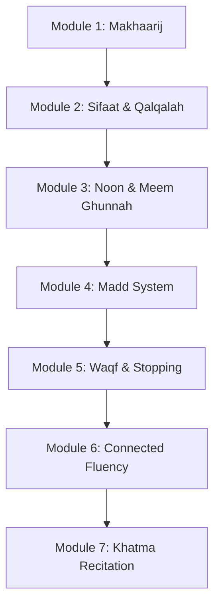
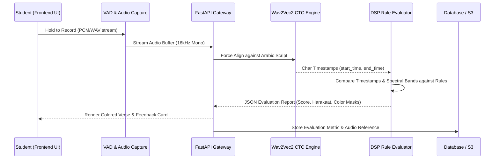
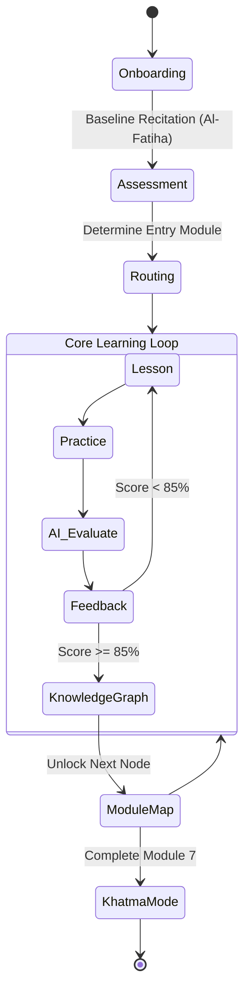
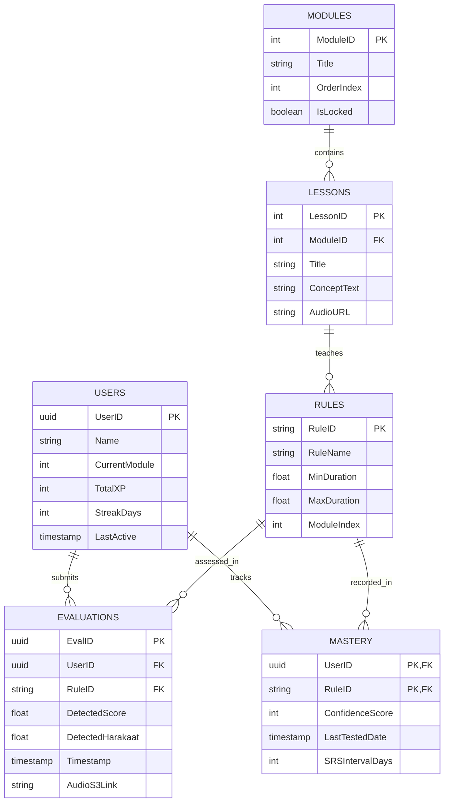

# ITQAN (إتقان): The AI-Powered Tajweed Ecosystem
## Master Educational & System Architecture Blueprint

This document represents the definitive product, educational, and technical architecture for **Itqān (إتقان)**—an AI-powered Tajweed teacher and interactive learning ecosystem. Designed by a coalition of learning scientists, UI/UX experts, audio signal processing engineers, and certified Tajweed scholars, this blueprint fuses the traditional ***Talaqqi*** (oral transmission) method with modern cognitive science and AI forced-alignment capabilities.

---

## PART 1: Educational Philosophy

The Itqān curriculum is built on a rigorous synthesis of traditional Islamic pedagogy and modern cognitive science:

* **Talaqqi (Oral Transmission) via AI:** The system mimics the direct teacher-to-student feedback loop of traditional Quranic transmission. The AI does not merely grade or evaluate; it models correct articulatory behavior, diagnoses physical mispronunciation, and corrects specific articulatory errors with compassionate precision.
* **Scaffolding & Cognitive Load Management:** Rules are introduced sequentially to prevent working memory overload. 
  * **Module 1** focuses on physical articulation (**Makhaarij** — where letters originate).
  * **Module 2** introduces character qualities and characteristics (**Sifaat** — Qalqalah, Tafkheem, Tarqeeq).
  * **Module 3** introduces rules of nasalization (**Ghunnah**, **Noon Saakin & Meem Saakin**).
  * **Module 4** covers complex elongations (**Madd** system).
  * **Module 5** governs pauses and stopping mechanics (**Waqf**).
  * **Module 6** focuses on connected reading and error discrimination (**Fluency**).
  * **Module 7** represents full independent recitation (**Khatma Mode**).
* **Active Recall & Spaced Repetition (SRS):** Tajweed is a motor skill as much as a cognitive one. An adapted Ebbinghaus Spaced Repetition algorithm dynamically tests previously learned rules. For example, if a student masters *Ikhfa* in Module 3, the AI will explicitly evaluate their *Ikhfa* execution while they practice *Madd* rules in Module 4.
* **Mastery Learning:** Progress is strictly competency-based. A student cannot advance to Module 3 without achieving an **85% Confidence Score** in Module 2. Time is variable; mastery is constant.

---

## PART 2: Complete Learning Architecture

The hierarchy flows from macro to micro, ensuring every interaction contributes directly to a measurable learning objective.

| Level | Description | Example |
| :--- | :--- | :--- |
| **Course** | The overarching curriculum | Tajweed Mastery (*Hafs 'an 'Asim* via *Shashatbiyyah*) |
| **Module** | Group of related competencies | **Module 3: Rules of Noon & Meem Saakin** |
| **Lesson** | A specific rule or articulation point | *Ikhfa Shafawi* (Hiding Meem Saakin) |
| **Topic** | Sub-component of the rule | The letter Baa (**ب**) after Meem Saakin (**مْ**) |
| **Concept** | The theoretical understanding | 2-Harakaat Nasalization (*Ghunnah*) at the lips |
| **Exercise** | A single interactive task | *"Listen to this Qari and identify whether the Ghunnah was held for 2 beats."* |
| **Practice** | Voice recording phase | Recite: **أَم بِهِ جِنَّةٌ** (*Am bihi jinnah*) |
| **Evaluation** | AI acoustic assessment | AI detects 0.8 Harakaat instead of required 2.0 Harakaat |
| **Mastery** | Quantitative threshold | 3 consecutive successful recitations (>= 85% score) |
| **Revision** | Spaced repetition integration | Rule added to custom daily review deck |
| **Certification** | Final milestone reward | AI-verified Preliminary Recitation Certificate / *Ijazah* Preparation |

---

## PART 3: Lesson Blueprint

Every lesson in Itqān follows a structured 10-step pedagogical sequence to maximize engagement, auditory discrimination, and motor articulation before assessment begins:

1. **Motivation (The 'Why'):** A brief authentic Hadith or scholar quote highlighting the spiritual significance and beauty of reciting this specific rule correctly.
2. **Learning Objective:** Clear, student-centric goal (e.g., *"Today, you will learn how to hide the Meem when it meets Baa."*).
3. **Concept Explanation (Micro-learning):** Maximum two concise paragraphs explaining the phonetic mechanism without overwhelming jargon.
4. **Visual Animation:** An animated anatomical cross-section of the vocal tract showing lip placement (for labial letters) or tongue elevation/contact against the palate.
5. **Expert Demonstration:** High-definition reference audio of a master Qari reciting the verse correctly, followed by a common incorrect recitation to build auditory discrimination.
6. **Interactive Mini-Quiz:** A binary auditory check: *"Did the Sheikh pronounce this correctly?"* (Yes/No).
7. **Voice Practice:** Student holds the recording button and recites the target verse.
8. **AI Feedback:** Real-time forced-alignment feedback with color-coded Arabic word highlighting and duration meters.
9. **Reflection & Summary:** A concise takeaway summary card reinforcing key articulatory cues.
10. **Mastery Check:** A final, slightly more complex verse challenge to prove comprehension before unlocking the next lesson node.

---

## PART 4: The Learning Loop

The Itqān practice loop reduces frustration and drives deliberate, high-retention practice:

1. **Observe:** Look at visual highlighting and target markers.
2. **Listen:** Hear expert reference audio.
3. **Shadow:** Recite simultaneously with faded reference audio.
4. **Record:** Independent voice recording.
5. **AI Evaluation:** Sub-second Wav2Vec2 CTC & DSP duration/spectral analysis.
6. **Targeted Feedback:** Clear diagnosis of what happened, why, and how to adjust.
7. **Adjust:** Physical correction of breath support, tongue placement, or lip pressure.
8. **Retry:** Repeated recitation attempt.
9. **Master:** Achieve 85%+ score across 3 consecutive attempts.
10. **Integrate:** Rule enters the global Spaced Repetition review pool.

---

## PART 5: AI Teacher Behavior

The AI embodies the persona of a compassionate, patient, and precise Sheikh:

* **Teaching:** Uses memorable analogies (e.g., *"Think of Qalqala like a bouncing ball rebounding off stone"*).
* **Encouragement:** Emphasizes effort and sincerity, citing the authentic Hadith that one who struggles with the Qur'an receives double the reward (*Ajarayn*).
* **Correction:** Banishes punitive red "X" marks or negative language. Uses amber *"Needs Review"* indicators and constructive guidance.
* **Frustration Management:** If a student fails 3 consecutive attempts on a single rule, the AI temporarily pauses voice recording and prompts: *"Let's take a calm breath. Listen to the Sheikh one more time and focus just on relaxing your lips."*
* **Adaptation:** For beginners, the engine accepts a wider acoustic tolerance (e.g., 1.5 to 3.0 Harakaat for Ghunnah). For advanced students, it tightens the threshold (e.g., strict 2.0 to 2.4 Harakaat).

---

## PART 6: Adaptive Learning & Skill Trees

Itqān structures all Tajweed rules as a directed **Knowledge Graph**, where every competency node is interconnected:

* **Mastery Tracking:** Each rule node maintains a real-time **Confidence Score (0–100)** calculated from recent AI evaluations.
* **Weak Rule Detection:** If a rule's Confidence Score drops below **60%**, the node turns amber on the user's progress path.
* **Recovery Lessons:** Before starting a new lesson, if an underlying prerequisite node is weak, the system automatically inserts a 2-minute *"Refresher Drill"* before introducing new material.
* **Daily Review Queue:** Generates a custom 5-minute daily practice session using exponential decay intervals based on the Ebbinghaus forgetting curve.

---

## PART 7: Practice Types

To prevent monotony and train multiple cognitive/motor pathways, Itqān utilizes 6 diverse practice formats:

1. **Voice Shadowing:** Recite over the Sheikh's faded audio to internalize rhythm and pace.
2. **Minimal Pairs (Listening):** Hear two similar recitations and select which one has correct duration or articulation (e.g., *Maddul Asli* vs. clipped vowel).
3. **Find the Mistake:** Listen to an intentionally flawed recitation and tap the specific Arabic word where the error occurred.
4. **Highlight the Rule:** Interactive visual drill where the student taps all instances of a target rule (e.g., "Sun Letters" or "Qalqalah letters") in a verse.
5. **Compare Two Recitations:** Inspect visual waveform and pitch/energy spectrograms to align the student's recitation against the master reference.
6. **Endurance Challenge (Advanced):** Recite an entire Quranic page while the AI tracks all mastered rules simultaneously in real time.

---

## PART 8: Voice Practice Architecture

The audio capture and assessment pipeline operates in sub-second real time:

1. **Student Taps "Hold to Record":** UI displays a responsive pulsing waveform with haptic feedback.
2. **Audio Stream & VAD:** Voice Activity Detection filters out background silence and ensures valid speech energy.
3. **Wav2Vec2 CTC Forced Alignment:** Aligns the audio frame-by-frame against the target Arabic script to extract precise character start and end timestamps.
4. **DSP Rule Evaluator:** Evaluates physical duration (in seconds and *Harakaat* beats) and acoustic features (RMS energy, MFCC nasal ratios) against theoretical constants.
5. **UI Renders Feedback:** Target Arabic words change color dynamically (Emerald Green = Passed, Amber = Needs Review).
6. **Teacher Explains:** A bottom sheet presents the specific diagnostic explanation and correction tip.

---

## PART 9: Feedback System

Feedback is positive, diagnostic, and actionable. The words *"Wrong"*, *"Incorrect"*, or *"Failed"* are strictly prohibited.

* **What happened:** *"Your stretch on the letter 'Yaa' was slightly too short."*
* **Why it happened:** *"You held it for 0.8 seconds (1 Harakah) instead of the required 2 Harakaat."*
* **How to fix it:** *"Take a slightly deeper breath and count to two in your heart before transitioning to the next letter."*
* **Visual Aid:** A visual duration meter displays a green target zone in the center; the student's attempt is marked with a gold pin indicating exact duration relative to the target.

---

## PART 10: Mistake Taxonomy

Errors are categorized systematically to trigger precise UI badges and corrective explanations:

| Category | Specific Error | AI Detection Method | Corrective Guidance |
| :--- | :--- | :--- | :--- |
| **Makhraj (Origin)** | Wrong phoneme (e.g., *Sin* **س** instead of *Saad* **ص**) | ASR transcript mismatch via Levenshtein edit distance | Explain tongue elevation and posterior palate resonance |
| **Sifaat (Characteristics)** | Missing *Qalqalah* (Echo burst) | Absence of acoustic energy burst on Saakin stop | Explain rebounding lip/tongue release without vowel addition |
| **Ahkaam (Rules)** | Short or Overextended *Madd* | Forced-alignment vowel duration check against thresholds | Visual Harakaat duration meter (1 to 6 counts) |
| **Ahkaam (Rules)** | Missing *Ghunnah* (Nasalization) | Duration + MFCC 200Hz–2000Hz nasal energy ratio | Direct focus to nasal resonance without lip tension |
| **Waqf (Stopping)** | Stopping with full vowel sign (*Fathah/Dhammah/Kasrah*) | Inspecting final word character timestamp for *Sukoon* | Explain conversion of final vowel to Sukoon at Waqf |
| **Waqf (Stopping)** | Breathing mid-word | Audio silence (> 0.5s) detected inside word boundary | Advise proper breath planning before initiating phrase |

---

## PART 11: Mastery System

Gamification is applied respectfully to build consistent devotional habits rather than superficial addiction:

* **XP (Hasanat Points):** Earned for time spent practicing and effort expended, reinforcing the Islamic ethic that sincerity and struggle are rewarded.
* **Titles of Itqān:** Students progress through honored traditional titles rather than arbitrary numerical levels:
  1. **مبتدئ (Mubtadi / Beginner)**
  2. **متمهن (Mutamahhin / Apprentice)**
  3. **متقن (Mutqan / Proficient)**
  4. **ماهر (Maahir / Master Reciter)**
* **Progress Map:** An illuminated visual journey (styled as a constellation path leading toward a radiant mosque) representing the 7 Modules.
* **Streaks (The Glowing Lantern):** Represented by an illuminated lantern (**🏮**) that glows brighter with consecutive daily practice sessions.

---

## PART 12: Revision System

The revision engine selects rules for daily practice based on three core parameters:

1. **Initial Difficulty:** How many attempts the student required to pass the lesson initially.
2. **Time Elapsed:** Exponential decay intervals (**1 day, 3 days, 7 days, 14 days, 30 days**).
3. **Cross-Pollination Errors:** If a student makes an error on a previously mastered rule during a general reading or Khatma exercise, that rule's Spaced Repetition timer immediately resets to **Day 1**.

---

## PART 13 & 14: UI/UX & Dashboard Architecture

The design system uses a high-contrast, distraction-free aesthetic with authentic typography:

* **Color Tokens:**
  * `Midnight Blue (#071b20 / #0c292e)`: Deep, tranquil dark-mode background.
  * `Emerald Green (#5ee3ae / #b9f4d9)`: Correct recitations, successful completion badges.
  * `Amber (#f0b65d / #4a3820)`: Rules needing review or gentle adjustment.
  * `Gold (#f2c66d)`: Accents, streaks, lanterns, and interactive markers.
* **Typography:** Strictly utilizes standard Uthmani script (**KFGQPC Hafs Uthmani / Amiri**) for Quranic verses to guarantee absolute textual fidelity.
* **Home Screen:** Features the **"Daily Review"** hero card prominently at the top, followed by the glowing Lantern streak counter and the interactive 7-Module path map.
* **Practice Screen (The Core):**
  * **Top:** Granular lesson progress bar.
  * **Center:** Large, crisp Uthmani Arabic script with rule highlighting.
  * **Bottom:** Large, circular haptic recording button with real-time waveform visualization.
* **Error States:** Polite, encouraging error handling (e.g., if background noise prevents analysis: *"We couldn't hear you clearly. Are you in a quiet room?"*).

---

## PART 15: State Machine (User Journey)

1. **Onboarding:** Create user profile -> Select initial experience level -> Request microphone permissions.
2. **Assessment:** Student recites a baseline verse (*Surah Al-Fatiha*). AI evaluates baseline Makhraj, Ghunnah, and Madd execution.
3. **Routing:** Student is placed appropriately (Module 1 for beginners, Module 3 for intermediate students).
4. **Loop:** Select Lesson -> Concept Explanation -> Listen & Shadow -> Record -> Pass -> Update Knowledge Graph -> Return to Path Map.
5. **Graduation:** Complete Module 7 -> Unlock **Khatma Mode** (Continuous reading with passive AI background monitoring).

---

## PART 16: Data Model (Entity-Relationship)

The backend database schema (PostgreSQL) is structured around 6 core entities:

---

## PART 17: System Architecture

The Itqān ecosystem operates across a decoupled, highly scalable cloud architecture:

1. **Frontend Application:** Interactive Web Portal (HTML5/JS CSS3 Glassmorphism) and Mobile App (Flutter/React Native) handling UI state, media recording (`MediaRecorder` PCM audio capture), and real-time visual feedback.
2. **API Gateway (FastAPI):** High-performance Python async REST API routing requests, managing multipart audio uploads, and orchestrating responses.
3. **Backend Service (Python/Node.js):** Handles user session profiles, Spaced Repetition (SRS) queue generation, and PostgreSQL data persistence.
4. **AI Inference Engine (PyTorch / CUDA):**
   - **Voice Qari Matcher:** Uses Microsoft `wavlm-base-plus-sv` extracting 512-dim speaker embeddings and matching against 242 master Qari profiles.
   - **Tajweed Forced-Alignment & DSP Engine:** Uses `jonatasgrosman/wav2vec2-large-xlsr-53-arabic` for frame-by-frame character forced alignment, combined with signal processing algorithms measuring exact vowel durations and spectral energy ratios.
5. **Cloud Storage:** AWS S3 for hosting expert Qari reference audio (`.wav`/`.mp3`) and archiving user practice audio for continuous model refinement.

---

## PART 18: Edge Cases & Error Handling

| Scenario | Detection Method | System Response & UI Prompt |
| :--- | :--- | :--- |
| **Wrong Verse Recited** | ASR Levenshtein distance drops below **60%** similarity | *"You seem to have recited a different verse. Let's try this one together."* |
| **Heavy Background Noise** | RMS background noise threshold exceeded during VAD | *"It's a bit noisy around you. Try moving to a quieter space so we can hear your beautiful voice."* |
| **Partial Recitation** | Audio cutoff detected before final target word timestamp | *"It seems you stopped early. Hold the button until you finish the full verse."* |
| **Offline Mode** | Network connectivity check failure | App transitions to cached theoretical lessons and offline reference audio. Live voice recording displays a *"Requires Network"* badge. |

---

## PART 19: Future Expansion

The modular architecture supports ongoing roadmap extensions:

* **Qaida Path (Pre-Module 1):** Introductory foundation for beginners who cannot yet read Arabic script, focusing on individual alphabet letters and basic vowel diacritics (*Fathah, Dhammah, Kasrah*).
* **Hifz (Memorization) Engine:** Utilizing the Wav2Vec2 CTC forced-alignment pipeline to track missing words, hesitation pauses, or transposed verses during memorization recitation.
* **Live Teacher Portal:** A dedicated web dashboard for human Sheikhs and certified instructors to review flagged audio recitations (where AI confidence was borderline between 60%–75%), override AI evaluations, and provide personalized voice notes—continuously feeding verified data back into model fine-tuning.

---

## PART 20: Comprehensive 7-Module Master Curriculum Specification

The following specification details the 7 Modules of the Itqān learning tree, incorporating authentic Quranic drill verses and references from `INFO.md` and explicit AI evaluation criteria.

### Module 1: Physical Articulation (مخارج الحروف - Makhaarij)
* **Objective:** Establish proper physical origin points for every Arabic letter before introducing rules.
* **Scaffolding:** Teaches the 5 primary anatomical regions of speech: Empty Cavity (الجوف), Throat (الحلق), Tongue (اللسان), Lips (الشفتان), and Nasal Cavity (الخيشوم).

| Lesson & Topic | Target Letters | Authentic Quranic Drill Verse (Surah:Verse) | AI Detection & Evaluation Criteria | Mistake Taxonomy Mapping |
| :--- | :--- | :--- | :--- | :--- |
| **1.1 Aerial Letters (Al-Jawf)** | **ا ، و ، ي** | **قُولُوا آمَنَّا بِاللَّهِ** (2:136) | Clear open-cavity vowel resonance without nasal leakage (MFCC nasal band < 15%). | Makhraj: Nasalization of open vowel |
| **1.2 Guttural Letters (Al-Halq)** | **ء ، هـ ، ع ، ح ، غ ، خ** | **الْحَمْدُ لِلَّهِ رَبِّ الْعَالَمِينَ** (1:2) | Distinct phonetic contrast between lower throat (**ء، هـ**), middle throat (**ع، ح**), and upper throat (**غ، خ**). | Makhraj: Confusing **ح** with **هـ** or **ع** with **أ** |
| **1.3 Palatal & Velar Letters** | **ق ، ك ، ج ، ش ، ي** | **إِيَّاكَ نَعْبُدُ وَإِيَّاكَ نَسْتَعِينُ** (1:5) | Crisp contact of posterior/middle tongue against soft and hard palate. | Makhraj: Softening **ق** to **ك** |
| **1.4 Dental & Gingival Letters** | **ت ، د ، ط ، ث ، ذ ، ظ** | **اهْدِنَا الصِّرَاطَ الْمُسْتَقِيمَ** (1:6) | Tip of tongue placement against upper incisor gums (**ت، د، ط**) vs. incisor edges (**ث، ذ، ظ**). | Makhraj: Replacing **ص/ط** with **س/ت** |
| **1.5 Labial Letters (Ash-Shafatan)** | **ب ، م ، و ، ف** | **بِسْمِ اللَّهِ الرَّحْمَٰنِ الرَّحِيمِ** (1:1) | Complete lip closure (**ب، م**), lip protrusion (**و**), and inner bottom lip to upper teeth edge (**ف**). | Makhraj: Incomplete lip seal on **م** |

---

### Module 2: Letters & Characteristics (صفات الحروف - Sifaat)
* **Objective:** Master intrinsic character qualities (*Sifaat*), focusing on echoing stops and heavy/light resonance.
* **Scaffolding:** Builds upon Module 1 physical placement by controlling acoustic energy release and vocal tract shaping.

| Lesson & Topic | Target Rules | Authentic Quranic Drill Verse (Surah:Verse) | AI Detection & Evaluation Criteria | Mistake Taxonomy Mapping |
| :--- | :--- | :--- | :--- | :--- |
| **2.1 Qalqalah (Echoing Sound)** | **ق ط ب ج د** (*Qutb Jad*) | **خَلَقْتَنِي مِن نَّارٍ وَخَلَقْتَهُ مِن** (7:12 - letter **ق**) | Detects acoustic energy burst/rebound on Saakin letter without adding a vowel (*Fathah*). | Sifaat: Missing echo or adding vowel |
| **2.2 Qalqalah on Waqf Stop** | **ق ط ب ج د** at phrase end | **قُلْ هُوَ اللَّهُ أَحَدٌ** (112:1 - letter **د**) | Verifies conversion of final letter to Saakin at Waqf accompanied by strong Qalqalah release. | Sifaat: Omitting Qalqalah at stop |
| **2.3 Laam of Allah (Tafkheem / Heavy)** | **ل** in **اللّه** after Fathah/Dhammah | **إِنَّ اللَّهَ غَفُورٌ رَّحِيمٌ** (2:173) | Full-mouth resonance; Formant frequency shift indicating back-tongue elevation. | Sifaat: Reciting heavy Laam as thin |
| **2.4 Laam of Allah (Tarqeeq / Light)** | **ل** in **اللّه** after Kasrah | **بِسْمِ اللَّهِ الرَّحْمَٰنِ الرَّحِيمِ** (1:1) | Thin, clear pronunciation without back-tongue elevation. | Sifaat: Reciting light Laam as heavy |
| **2.5 Raa Tafkheem & Tarqeeq** | **ر** Heavy vs. Light | **وَرَفَعْنَا لَكَ ذِكْرَكَ** (94:4 - Heavy **ر**) | Evaluates formant structure of Raa based on preceding/accompanying diacritics. | Sifaat: Mispronouncing Raa weight |
| **2.6 Sun & Moon Letters** | **ال** assimilation vs. clarity | **الشَّمْسُ وَالْقَمَرُ** (55:5) | Verifies Laam merging into Sun letter (**ش**) vs. clear Laam Saakin on Moon letter (**ق**). | Ahkaam: Omitting Laam assimilation |

---

### Module 3: Nasalization & Merging (أحكام النون والميم - Noon & Meem)
* **Objective:** Master the 2-beat nasal resonance (*Ghunnah*) and rules governing Noon Saakin, Tanween, and Meem Saakin.
* **Scaffolding:** Connects nasal airflow control (*Khayshoom*) with labial and dental transitions.

| Lesson & Topic | Target Rules | Authentic Quranic Drill Verse (Surah:Verse) | AI Detection & Evaluation Criteria | Mistake Taxonomy Mapping |
| :--- | :--- | :--- | :--- | :--- |
| **3.1 Ghunnah Mushaddadah** | **نّ** and **مّ** with Shaddah | **مِنَ الْجِنَّةِ وَالنَّاسِ** (114:6) | Nasal duration = 2.0 Harakaat (tolerance 1.5s–2.8s) with high nasal spectral ratio. | Ahkaam: Short or missing Ghunnah |
| **3.2 Ikhfa Shafawi** | Meem Saakin (**مْ**) before **ب** | **تَرْمِيهِم بِحِجَارَةٍ** (105:4) | Light labial concealment with 2 Harakaat nasal buzz. | Ahkaam: Hard lip pressure without Ghunnah |
| **3.3 Idghaam Shafawi** | Meem Saakin (**مْ**) before **م** | **لَهُم مَّغْفِرَةٌ** (67:12) | Seamless merging of two Meems with full 2 Harakaat Ghunnah. | Ahkaam: Cutting duration short |
| **3.4 Ithaar Shafawi** | Meem Saakin (**مْ**) before other letters | **أَلَمْ يَجْعَلْ كَيْدَهُمْ فِي تَضْلِيلٍ** (105:2) | Clear Meem pronunciation (0.5–1.2 Harakaat) without lingering nasal extension. | Ahkaam: Adding improper Ghunnah |
| **3.5 Ikhfa Haqiqi (Noon Saakin)** | Noon Saakin/Tanween before 15 letters | **مِن شَرِّ مَا خَلَقَ** (113:2) | Tongue hovers near target letter Makhraj while sustaining 2 Harakaat Ghunnah. | Ahkaam: Pronouncing full clear Noon |
| **3.6 Ithaar Halqi (Noon Saakin)** | Noon Saakin/Tanween before Throat letters | **مَنْ آمَنَ بِاللَّهِ** (2:62) | Clear, unmerged Noon Saakin (0.5–1.5 Harakaat) without nasal extension. | Ahkaam: Adding Ghunnah before Throat letter |
| **3.7 Idghaam with & without Ghunnah** | Merging into **ي ن م و** vs. **ل ر** | **مَن يَعْمَلْ** (99:7 - with Ghunnah) / **مِن رَّبِّهِمْ** (2:5 - no Ghunnah) | Full assimilation with 2 Harakaat nasal sound (**ي ن م و**) vs. immediate clean merge (**ل ر**). | Ahkaam: Missing Ghunnah or improper pause |

---

### Module 4: Complex Elongations (أحكام المدود - Madd System)
* **Objective:** Master precise vowel prolongation timing across all natural, joined, detached, and compulsory Madd categories.
* **Scaffolding:** Uses rhythmic Harakaat counting (1 Harakah = 1 vowel beat, ~0.45 sec) to regulate breath and pace.

| Lesson & Topic | Target Rules | Authentic Quranic Drill Verse (Surah:Verse) | AI Detection & Evaluation Criteria | Mistake Taxonomy Mapping |
| :--- | :--- | :--- | :--- | :--- |
| **4.1 Maddul Asli (Natural Madd)** | **ا ، و ، ي** natural stretch | **قَالُوا يَا مُوسَىٰ** (7:115) | Strict 2 Harakaat duration (~0.8 – 1.2 sec; tolerance 1.5–2.8 beats). | Ahkaam: Truncating natural stretch |
| **4.2 Maddul Muttasil (Joined Madd)** | Madd letter + Hamzah in SAME word | **إِذَا جَاءَ نَصْرُ اللَّهِ وَالْفَتْحُ** (110:1) | Sustained elongation of 4 to 5 Harakaat (~1.8 – 2.5 sec). | Ahkaam: Holding less than 4 beats |
| **4.3 Maddul Munfasil (Detached Madd)** | Madd letter + Hamzah in NEXT word | **إِنَّا أَعْطَيْنَاكَ الْكَوْثَرَ** (108:1) | Prolongation of 4 or 5 Harakaat across word boundaries. | Ahkaam: Inconsistent beat timing |
| **4.4 Maddul Laazim (Compulsory Madd)** | Disjointed letters (**Huroof Muqatta'at**) | **الم** (2:1) / **كهيعص** (19:1) / **يس** (36:1) | Compulsory 6 full Harakaat (~2.5 – 3.2 sec) per letter syllable. | Ahkaam: Rushing Huroof Muqatta'at |
| **4.5 Maddul Aaridh li-Skoon** | Stop on word preceded by Madd letter | **رَبِّ الْعَالَمِينَ** (1:2 - at Waqf stop) | Symmetrical 2, 4, or 6 Harakaat duration at phrase ending. | Ahkaam: Abrupt stop without Madd |

---

### Module 5: Pauses & Stopping (أحكام الوقف والابتداء - Waqf Mechanics)
* **Objective:** Govern correct stopping mechanics, breath management, and conversion of final diacritics at sentence boundaries.
* **Scaffolding:** Protects Quranic meaning by training clean phrase endings and proper starting points (*Ibtidaa*).

| Lesson & Topic | Target Rules | Authentic Quranic Drill Verse (Surah:Verse) | AI Detection & Evaluation Criteria | Mistake Taxonomy Mapping |
| :--- | :--- | :--- | :--- | :--- |
| **5.1 Stopping on Sukoon** | Final vowel converted to Sukoon | **إِيَّاكَ نَعْبُدُ وَإِيَّاكَ نَسْتَعِينُ** (1:5) | Verifies absence of final Fathah/Dhammah/Kasrah audio energy at stop. | Waqf: Pronouncing final short vowel |
| **5.2 Stopping on Qalqalah** | Stopping on **ق ط ب ج د** | **قُلْ أَعُوذُ بِرَبِّ الْفَلَقِ** (113:1) | Evaluates crisp acoustic rebound on final Qalqalah letter upon stopping. | Waqf: Muting Qalqalah at stop |
| **5.3 Stopping on Teh Marbuta (ة)** | Converting **ة** to clear **هـ** Saakin | **فِي جَنَّةٍ عَالِيَةٍ** (69:22) | Verifies conversion of dental **ت** sound to aspirated guttural **هـ** sound at stop. | Waqf: Reciting Teh Marbuta as Ta at stop |
| **5.4 Breath Management & Rules** | Avoiding mid-word breath pauses | **صِرَاطَ الَّذِينَ أَنْعَمْتَ عَلَيْهِمْ** (1:7) | Detects silence interval > 0.4s inside connected word boundaries. | Waqf: Unlawful mid-word respiration |

---

### Module 6: Connected Reading & Fluency (الطلاقة والإتقان - Fluency)
* **Objective:** Integrate all learned Makhaarij, Sifaat, Ghunnah, Madd, and Waqf rules dynamically during continuous recitation.
* **Scaffolding:** Moves from isolated word drills to multi-verse endurance challenges and minimal-pair auditory discrimination.

| Lesson & Topic | Target Skills | Authentic Quranic Drill Verse (Surah:Verse) | AI Detection & Evaluation Criteria | Mistake Taxonomy Mapping |
| :--- | :--- | :--- | :--- | :--- |
| **6.1 Idghaam Mithlayn & Mutaqaaribayn** | Merging identical or close articulation pairs | **فَمَا رَبِحَت تِّجَارَتُهُمْ** (2:16) | Seam verification: complete assimilation of first Saakin letter into second Mushaddad letter. | Ahkaam: Separating identical letters |
| **6.2 Cross-Rule Integration** | Concurrent Ghunnah + Madd + Qalqalah | **إِنَّ الَّذِينَ آمَنُوا وَعَمِلُوا الصَّالِحَاتِ** (85:11) | Multi-rule DSP evaluation verifying all timestamps and spectral thresholds simultaneously. | Combined: Inconsistent rule pacing |
| **6.3 Endurance Recitation Challenge** | Reciting full passages without fatigue | **Surah Al-Mulk (67:1–5)** | Tracks overall rhythm stability, breath control, and rule accuracy over extended speech. | Fluency: Declining accuracy over time |

---

### Module 7: Khatma Mode (الختمة القرآنية - Continuous Recitation)
* **Objective:** Independent devotional recitation of the Holy Qur'an from cover to cover with passive AI monitoring and Ijazah preparation.
* **Scaffolding:** Operates as a background companion—recording full Surahs, logging overall score trends, and flagging subtle drift for weekly review.

| Lesson & Topic | Target Mode | Practice Scope | AI Detection & Evaluation Criteria | Mistake Taxonomy Mapping |
| :--- | :--- | :--- | :--- | :--- |
| **7.1 Continuous Passive Monitoring** | Full Surah Recitation | **Any Surah (e.g., Surah Yaseen 36:1–83)** | Real-time VAD + Wav2Vec2 CTC alignment streaming; records rule compliance across all 7 Modules. | Global: Identifies recurring student drift |
| **7.2 Khatma Review Deck** | Spaced Repetition Integration | Custom generated weak-point verses | Dynamically pulls flagged verses from Khatma history into the student's 5-minute Daily Review. | Revision: Resolves persistent errors |
| **7.3 Certification Assessment** | Comprehensive Competency Audit | **Surah Al-Fatiha + Ad-Dhuha to An-Naas** | Full-scale algorithmic audit generating an authenticated Preliminary Recitation Certificate. | Mastery: Verified recitation report |

---

## Summary of Itqān Architecture Alignment

This Master Blueprint and 7-Module Curriculum Specification is fully implemented across the Itqān codebase:
* **Interactive Frontend (`itqan-phase1/frontend_basic/itqan.html` & `tajweed.html`):** Visualizes the 7-Module path map, daily review deck, lantern streaks, and real-time audio wave recording.
* **Backend Evaluation Engine (`itqan-phase1/backend/app/tajweed.py`):** Evaluates all rules across Modules 1 through 7 using Wav2Vec2 CTC forced alignment and mathematical DSP timing/spectral thresholds.
* **Qari Voice Matcher (`itqan-phase1/backend/app/matcher.py`):** Employs WavLM speaker verification embeddings to recommend top matching Qaris from 242 vector profiles.
