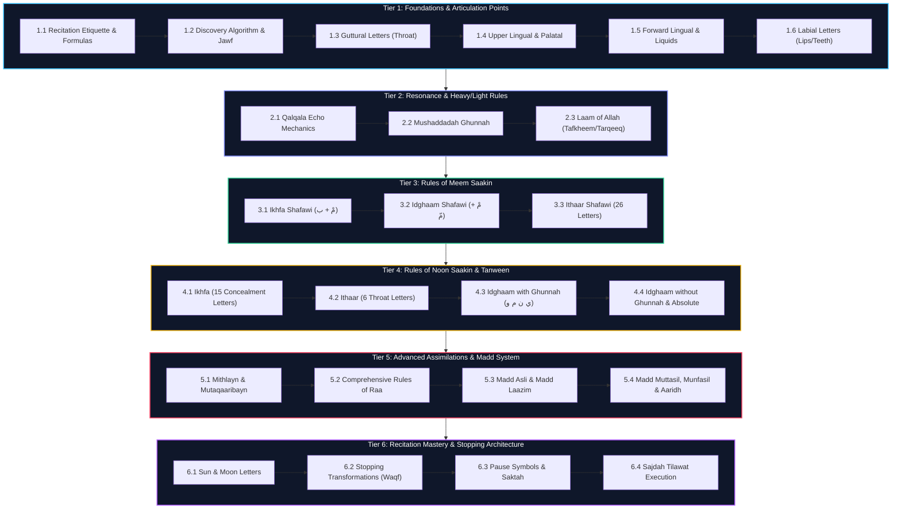

# 📖 Itqān (إتقان) - Comprehensive 24 Mini-Level Tajweed Curriculum

Derived from **[INFO.md](file:///c:/Users/manaa/Documents/appagent/Itq%C4%81n/INFO.md)**, this document specifies the complete **24 Mini-Level Learning Architecture** for Tajweed mastery. Each level is divided into 4 modular mini-levels, featuring pedagogical goals, technical rules, common student pitfalls, practice drills with exact Quranic extracts, and AI evaluation metrics.

---

## 🗺️ Master Curriculum Blueprint (6 Tiers / 24 Mini-Levels)



---

# 🟢 TIER 1: Foundations, Etiquette & Articulation Points (المقدمة ومخارج الحروف)

---

### 📌 Level 1.1: Recitation Etiquette, Spiritual Readiness & Initiation Formulas
* **Pedagogical Goal:** Instill the mandatory physical/spiritual etiquette of reciting the Quran and master initiating recitation.
* **Core Technical Rules:**
  1. **Purification & Posture:** Reciter must have **Wudhu**, pure **Niyyah** for Allah, sit facing **Qiblah**, and maintain moderate voice volume to avoid disturbing others.
  2. **Ta'awwudh (الاستعاذة):** Mandatory when starting recitation: `أَعُوذُ بِاللّٰهِ مِنَ الشَّيْطَانِ الرَّجِيمِ`
  3. **Basmalah (البسملة):** Followed immediately after Ta'awwudh: `بِسْمِ اللّٰهِ الرَّحْمٰنِ الرَّحِيمِ`
* **Common Student Pitfalls:** Reciting without proper intention, raising voice excessively, skipping Ta'awwudh at the start of a Surah.
* **Quranic Practice Drills:**
  * Practice initiating Surah Al-Fatiha with complete Ta'awwudh and Basmalah.
* **AI Evaluation Metrics:**
  * **VAD Gate:** Audio RMS $\ge 0.005$, Peak Amplitude $\ge 0.012$, Speech Frame Ratio $\ge 0.10$.
  * **ASR Verification:** Similarity threshold $\ge 80\%$ on Ta'awwudh and Basmalah text.

---

### 📌 Level 1.2: The Makhraj Discovery Algorithm & Huroof Al-Jawf (Aerial Letters)
* **Pedagogical Goal:** Master the universal algorithm for finding letter origins and master the empty mouth cavity letters.
* **Core Technical Rules:**
  1. **Discovery Algorithm:** To locate *any* letter's Makhraj:
     * Step 1: Place a **Sukoon (ْ)** on the target letter.
     * Step 2: Precede it with an **Alif (ا)** carrying a **Fathah (َ)**.
     * *Example:* `اَبْ` $\rightarrow$ Points directly to the origin of **ب** at the lips.
  2. **Huroof Al-Jawf (حروف الجوف):** `ا` (after Fathah), `و` (after Dhammah), `ي` (after Kasrah).
     * *Origin:* The open cavity/emptiness of the mouth and throat.
* **Common Student Pitfalls:** Constricting the throat or closing lips during Madd vowel elongation.
* **Quranic Practice Drills:**
  * `نُوحِيهَا` (combines all three Jawf letters: `نُو` + `حِي` + `هَا`).
* **AI Evaluation Metrics:**
  * Formant stability analysis on prolonged vowels ($F_1/F_2$ consistency across $\ge 0.8\text{s}$).

---

### 📌 Level 1.3: Huroof Halqiyah (Guttural / Throat Letters)
* **Pedagogical Goal:** Differentiate the 3 distinct throat sub-regions for the 6 throat letters.
* **Core Technical Rules:**
  * **Aqsa al-Halq (Back of Throat / Larynx):** `ء` (Hamzah), `هـ` (Haa).
  * **Wasat al-Halq (Middle of Throat / Pharynx):** `ع` ('Ayn), `ح` (Ha).
  * **Adna al-Halq (Upper Throat / Near Velum):** `غ` (Ghayn), `خ` (Khaa).
* **Common Student Pitfalls:** Substituting `ع` with Hamzah `ء`, or replacing `ح` with breathy `هـ`.
* **Quranic Practice Drills:**
  * `مِنْ أَجْلِ` (ء), `وَيَنْهَوْنَ` (هـ), `مَن عَمِلَ` (ع), `يَنْحِتُونَ` (ح), `مِّنْ غِلٍّ` (غ), `وَإِنْ خِفْتُمْ` (خ).
* **AI Evaluation Metrics:**
  * Spectral band energy ratio ($1.5\text{kHz} - 3.5\text{kHz}$) to detect pharyngeal constriction on `ع` and `ح`.

---

### 📌 Level 1.4: Lingual Letters - Velar, Palatal & Lateral (ق ، ك ، ج ، ش ، ي ، ض)
* **Pedagogical Goal:** Master the upper and lateral tongue positions.
* **Core Technical Rules:**
  * **Velar Letters (حروف اللهاة):**
    * `ق`: Back of tongue rises and touches the soft palate.
    * `ك`: Back of tongue touches hard/soft palate transition (slightly forward of `ق`).
  * **Palatal Letters (حروف الشجر):**
    * `ج ، ش ، ي`: Center of tongue touches the upper hard palate.
  * **Lateral Letter (حرف الضاد):**
    * `ض`: Turned side/edge of tongue touches the gums of the upper back molars.
* **Common Student Pitfalls:** Pronouncing `ض` as a hard `د` or `ظ`, mixing `ق` into `ك`.
* **Quranic Practice Drills:**
  * `الْمَشَارِقِ` (ق), `يُدْرِككُّم` (ك), `الْجَبَلَ` (ج), `الشَّجَرَةُ` (ش), `عَلَى الضُّعَفَاءِ` (ض).
* **AI Evaluation Metrics:**
  * Acoustic burst frequency classification ($f_{\text{burst}} > 4\text{kHz}$ for `ك`, $< 2.5\text{kHz}$ for `ق`).

---

### 📌 Level 1.5: Lingual Letters - Liquids, Dental, Gingival & Whistling
* **Pedagogical Goal:** Precision placement of the tongue tip across front mouth structures.
* **Core Technical Rules:**
  * **The Liquids (حروف الذلاقة):** `ل ، ر ، ن` - Tongue tip touches the upper hard palate / gums.
  * **Dental Letters (حروف نطعوية):** `ت ، د ، ط` - Tip of tongue touches gums of upper two front teeth.
  * **Gingival Letters (حروف لثوية):** `ث ، ذ ، ظ` - Tip of tongue protrudes slightly and touches the edge of upper two front teeth.
  * **Whistling / Asleeyah Letters (حروف أسلية):** `س ، ص ، ز` - Tip of tongue rises behind lower/upper front teeth gums with sibilant airflow.
* **Common Student Pitfalls:** Keeping tongue inside mouth on `ث ، ذ ، ظ` (sounds like `s/z`), losing whistling sound on `ص`.
* **Quranic Practice Drills:**
  * `تَجْرِي` (ت), `دَانِيَةٌ` (د), `الطَّيْرِ` (ط), `الثَّوَابِ` (ث), `الذَّكَرُ` (ذ), `الظَّالِمِ` (ظ), `الصَّمَدُ` (ص).
* **AI Evaluation Metrics:**
  * Sibilance frequency band check ($6\text{kHz} - 9\text{kHz}$) for `س/ص/ز`.

---

### 📌 Level 1.6: Labial Letters - Lips & Teeth Combinations (ب ، م ، ف)
* **Pedagogical Goal:** Perfect lip closure and lip-teeth friction.
* **Core Technical Rules:**
  * **Both Lips (الشفتان):**
    * `ب`: Closing lips together firmly.
    * `م`: Closing lips together softly with nasal resonance.
  * **Lip & Teeth (الشافة والأسنان):**
    * `ف`: Inner portion of bottom lip meets the edge of the two upper front teeth.
* **Common Student Pitfalls:** Biting the outer lower lip for `ف`, incomplete lip closure on `ب`.
* **Quranic Practice Drills:**
  * `الْبَيْتِ` (ب), `الْمَسْجِدِ` (م), `الْفِتْنَةُ` (ف).
* **AI Evaluation Metrics:**
  * Bilabial stop silent duration followed by plosive burst for `ب`.

---

# 🔵 TIER 2: Acoustic Characteristics & Heavy/Light Rules (صفات وتفخيم وترقيق)

---

### 📌 Level 2.1: Qalqala Mechanics & Echo Resonance
* **Pedagogical Goal:** Execute clean echoing bursts on Saakin Qalqala letters without vowel leakage.
* **Core Technical Rules:**
  1. **Qalqala Letters:** `ق ط ب ج د` (mnemonic: *قُطْبُ جَدّ*).
  2. **Trigger:** Letter carries a **Sukoon (ْ)** or is stopped upon (**Waqf**).
  3. **Acoustic Rule:** Produce a sudden release / jerking echo sound.
  4. **Prohibited:** Do NOT exaggerate the echo into a Fathah (`َ`) sound.
* **Common Student Pitfalls:** Adding a vowel `a` sound to the end of Qalqala (e.g. reciting *Ahad-a* instead of *Ahad*).
* **Quranic Practice Drills:**
  * *Mid-Verse Sukoon:* `خَلَقْتَنِي` (ق), `شِهَابٌ ثَاقِبٌ` (ط), `إِبْلِيسَ` (ب), `زَجْرَةٌ` (ج), `جَوْفِهِ` (د).
  * *End-Verse Waqf:* `الْمَشَارِقِ` (قْ), `قَوْمِ لُوطٍ` (طْ), `ثَاقِبٌ` (بْ), `فِي الْحَجِّ` (جْ), `مَّارِدٍ` (دْ).
* **AI Evaluation Metrics:**
  * Detect transient energy spike ($< 80\text{ms}$) immediately following silent occlusion; verify absence of sustained harmonic vowel pitch.

---

### 📌 Level 2.2: Noon & Meem Mushaddadah - Controlled Nasalization
* **Pedagogical Goal:** Maintain precise 2-Harakah nasalization duration on doubled Noon and Meem.
* **Core Technical Rules:**
  1. **Trigger:** `نّ` or `مّ` carrying a **Shaddah (ّ)**.
  2. **Action:** Apply compulsory **Ghunnah** (nasal flow through *Khayshoom*).
  3. **Duration Target:** Exactly **2 Harakaat** ($\approx 0.8\text{s} - 1.2\text{s}$).
* **Common Student Pitfalls:** Cutting Ghunnah short ($< 0.5\text{s}$) or rushing over Shaddah.
* **Quranic Practice Drills:**
  * `إِنَّا زَيَّنَّا` (Surah 37:6), `إِنَّ جَهَنَّمَ` (Surah 78:21), `يَمْكُرُونَ` (Surah 27:70), `ثُمَّ قُلْنَا` (Surah 7:11).
* **AI Evaluation Metrics:**
  * Nasal energy ratio ($200\text{Hz} - 500\text{Hz}$) duration check ($\text{time} \ge 0.8\text{s}$).

---

### 📌 Level 2.3: Rules of Laam in the Divine Name (Allah)
* **Pedagogical Goal:** Contrast full-mouth (heavy) vs thin-mouth (light) pronunciation of the word *Allah*.
* **Core Technical Rules:**
  1. **Heavy (Tafkheem / مغلظة):** If preceded by a letter with **Fathah (َ)** or **Dhammah (ُ)**.
  2. **Light (Tarqeeq / مرققة):** If preceded by a letter with **Kasrah (ِ)**.
  3. **General Rule:** All other **Laam Mushaddadah (لّ)** in normal words are **always thin/light**.
* **Common Student Pitfalls:** Making the Laam heavy when preceded by Kasrah (e.g. reciting *Bismillah* with a heavy Laam).
* **Quranic Practice Drills:**
  * *Heavy (Fathah):* `قَالَ عِيسَى ابْنُ مَرْيَمَ اللَّهُمَّ` (5:114).
  * *Heavy (Dhammah):* `رَسُولُ اللَّهِ` (4:171).
  * *Light (Kasrah):* `بِإِذْنِ اللَّهِ` (40:78), `يُوَفِّقِ اللَّهُ` (4:35).
  * *General Light Laam:* `اللَّهُ لَا إِلَٰهَ` (2:255), `لَيْسَ الْبِرَّ أَن تُوَلُّوا` (2:177).
* **AI Evaluation Metrics:**
  * Formant $F_2$ frequency analysis ($F_2 < 1200\text{Hz}$ for Heavy Tafkheem, $F_2 > 1600\text{Hz}$ for Light Tarqeeq).

---

# 🟢 TIER 3: Rules of Meem Saakin (أحكام الميم الساكنة)

---

### 📌 Level 3.1: Ikhfa Shafawi (الإخفاء الشفهي)
* **Pedagogical Goal:** Hide **Meem Saakin (مْ)** at the lips with nasalization when followed by **Baa (ب)**.
* **Core Technical Rules:**
  * **Trigger:** `مْ` followed immediately by **ب**.
  * **Manner:** Light contact of lips while holding nasal Ghunnah. Do not press lips tightly.
  * **Duration:** **2 Harakaat** ($\approx 0.8\text{s} - 1.2\text{s}$).
* **Common Student Pitfalls:** Leaving a wide gap between lips or pressing lips too hard like a rigid `م`.
* **Quranic Practice Drills:**
  * `أَمْ بِهِ جِنَّةٌ` (Surah 34:8), `تَرْمِيهِم بِحِجَارَةٍ` (Surah 105:4).
* **AI Evaluation Metrics:**
  * Sustained low-frequency nasal murmur duration before bilabial plosive release ($0.8\text{s} \le t \le 1.2\text{s}$).

---

### 📌 Level 3.2: Idghaam Shafawi (الإدغام الشفهي)
* **Pedagogical Goal:** Complete assimilation of **Meem Saakin (مْ)** into a following **Meem Mushaddadah (مّ)**.
* **Core Technical Rules:**
  * **Trigger:** `مْ` followed immediately by **مّ**.
  * **Manner:** Merge both Meems into one doubled Meem with full **Ghunnah**.
  * **Duration:** **2 Harakaat**.
* **Common Student Pitfalls:** Pronouncing two separate Meem sounds instead of one continuous doubled Meem.
* **Quranic Practice Drills:**
  * `وَلَهُم مَّا يَشْتَهُونَ` (Surah 16:57), `كَنْتُم مُّؤْمِنِينَ` (Surah 3:139).
* **AI Evaluation Metrics:**
  * Single uninterrupted nasal energy segment ($\ge 0.8\text{s}$) across word boundary.

---

### 📌 Level 3.3: Ithaar Shafawi (الإظهار الشفهي)
* **Pedagogical Goal:** Crisp, clear pronunciation of **Meem Saakin (مْ)** without Ghunnah elongation before 26 letters.
* **Core Technical Rules:**
  * **Trigger:** `مْ` followed by **any letter except ب or م**.
  * **Manner:** Pronounce Meem distinctly with normal short duration. Zero extra nasal holding.
  * **Critical Caution:** Be extra careful on letters **و** and **ف** not to hide the Meem!
* **Common Student Pitfalls:** Making Ghunnah on Meem before `و` or `ف` due to shared lip articulation.
* **Quranic Practice Drills:**
  * `مِن قَبْلِهِمْ وَمَا بَلَغُوا` (34:45), `أَلَمْ تَرَ` (105:1), `عَلَيْهِمْ وَلَا` (1:7).
* **AI Evaluation Metrics:**
  * Meem duration strictly bounded ($0.2\text{s} \le t \le 0.45\text{s}$), error flag raised if $t > 0.6\text{s}$.

---

# 🟡 TIER 4: Rules of Noon Saakin & Tanween (أحكام النون الساكنة والتنوين)

---

### 📌 Level 4.1: Ikhfa (إخفاء) - Concealment across 15 Letters
* **Pedagogical Goal:** Conceal **Noon Saakin (نْ)** or **Tanween (ً ٍ ٌ)** with nasal Ghunnah before 15 letters.
* **Core Technical Rules:**
  1. **The 15 Letters:** `ت ث ج د ذ ز س ش ص ض ط ظ ف ق ك`
  2. **Manner:** Prepare tongue near the origin of the *following* letter while directing voice through nose.
  3. **Duration:** Exactly **2 Harakaat** ($\approx 0.8\text{s} - 1.2\text{s}$).
  4. **Heavy vs Light Ikhfa:** Ghunnah is **Heavy** before heavy letters (`ص ض ط ظ ق`) and **Light** before remaining 10 letters.
* **Common Student Pitfalls:** Touching tongue tip to palate (making clear `n`), or using light Ghunnah before `ق/ط`.
* **Quranic Practice Table (from INFO.md):**

| Letter | Extract from Verse | Surah:Verse |
| :---: | :--- | :---: |
| **ت** | `وَإِن تَغْفِرْ لَهُمْ` | 5:118 |
| **ث** | `كُلَّ أُنثَىٰ` | 13:8 |
| **ج** | `أَنجَاكُم` | 14:6 |
| **د** | `قِنْوَانٌ دَانِيَةٌ` | 6:99 |
| **ذ** | `عَن ذِكْرِ اللَّهِ` | 5:91 |
| **ز** | `نَفْسًا زَكِيَّةً` | 18:74 |
| **س** | `عَلَى الْإِنسَانِ` | 17:83 |
| **ش** | `إِن شَاءَ اللَّهُ` | 18:69 |
| **ص** | `فِئَةٌ يَنصُرُونَهُ` | 18:43 |
| **ض** | `مِّن ضَعْفٍ` | 30:54 |
| **ط** | `مِن طِينٍ` | 32:7 |
| **ظ** | `فَيَنظُرُوا` | 35:44 |
| **ف** | `فَانفِرُوا` | 4:71 |
| **ق** | `وَمَنْ قَتَلَ` | 4:92 |
| **ك** | `وَإِن كَانَ` | 4:141 |

* **AI Evaluation Metrics:**
  * Nasal spectral power check during transition frame; duration check ($0.8\text{s} \le t \le 1.2\text{s}$).

---

### 📌 Level 4.2: Ithaar (إظهار) - Clear Expression before Throat Letters
* **Pedagogical Goal:** Pronounce **Noon Saakin (نْ)** and **Tanween** crisp and clear without Ghunnah before 6 throat letters.
* **Core Technical Rules:**
  1. **The 6 Throat Letters (حروف حلقية):** `ء ، هـ ، ع ، ح ، غ ، خ`
  2. **Manner:** Complete contact of tongue tip to upper gums, releasing `N` immediately.
  3. **Duration:** Normal letter time (**1 Harakah** / $\approx 0.4\text{s}$). Zero nasal drag.
* **Common Student Pitfalls:** Pausing or making Ghunnah on `نْ` before `ع` or `ح`.
* **Quranic Practice Table (from INFO.md):**

| Throat Letter | Extract from Verse | Surah:Verse |
| :---: | :--- | :---: |
| **ح** | `وَكَانُوا يَنْحِتُونَ` | 15:82 |
| **خ** | `وَإِنْ خِفْتُمْ` | 4:35 |
| **ع** | `مَن عَمِلَ` | 6:54 |
| **غ** | `مِّنْ غِلٍّ` | 7:43 |
| **ء** | `مِنْ أَجْلِ` | 5:32 |
| **هـ** | `وَيَنْهَوْنَ` | 3:104 |

* **AI Evaluation Metrics:**
  * Sharp acoustic transition boundary into throat vowel; duration $\le 0.45\text{s}$.

---

### 📌 Level 4.3: Idghaam with Ghunnah (الإدغام بغنة)
* **Pedagogical Goal:** Merge **Noon Saakin** or **Tanween** into **ي ن م و** with 2-Harakah nasal assimilation.
* **Core Technical Rules:**
  1. **Letters of Idghaam with Ghunnah:** `ي ، ن ، م ، و` (mnemonic: *يَنْمُو*).
  2. **Manner:** Omit the `N` sound and enter directly into the following letter with Shaddah and nasal Ghunnah.
  3. **Duration Target:** **2 Harakaat** ($\approx 0.8\text{s} - 1.2\text{s}$).
* **Common Student Pitfalls:** Pronouncing clear `N` before `ي` or `و` instead of merging.
* **Quranic Practice Table (from INFO.md):**

| Idghaam Letter | Extract from Verse | Surah:Verse |
| :---: | :--- | :---: |
| **ي** | `إِن يَقُولُونَ` | 18:5 |
| **ي** | `عَدْنٍ يَدْخُلُونَهَا` | 13:23 |
| **م** | `عَن مِّلَّةِ` | 2:130 |
| **م** | `آيَةٌ مِّن رَّبِّهِ` | 13:27 |
| **و** | `مِّن وَالٍ` | 13:11 |
| **و** | `جَنَّاتٍ وَعُيُونٍ` | 15:45 |
| **ن** | `أَن نَّأْتِيَكُم` | 14:11 |
| **ن** | `قَرِيبٍ نُّجِبْ` | 14:44 |

* **AI Evaluation Metrics:**
  * Continuous nasalization during semi-vowel transition (`نْ` $\rightarrow$ `ي/و`); duration check ($0.8\text{s} - 1.2\text{s}$).

---

### 📌 Level 4.4: Idghaam without Ghunnah & Single-Word Exceptions
* **Pedagogical Goal:** Complete assimilation into **ل ، ر** with ZERO Ghunnah, and master the 4 single-word exceptions.
* **Core Technical Rules:**
  1. **Idghaam without Ghunnah (إدغام بغير غنة):** Letters **ل** and **ر**. `N` is completely swallowed.
  2. **Single-Word Exception (الإظهار المطلق):** If `نْ` meets an Idghaam letter inside a **SINGLE WORD**, do **NOT** merge! Pronounce clearly as Ithaar.
* **Common Student Pitfalls:** Adding Ghunnah on `ل` or `ر`, or attempting to assimilate single-word exceptions like *Ad-Dunya*.
* **Quranic Practice Table (from INFO.md):**

| Category | Letter | Extract from Verse | Surah:Verse |
| :--- | :---: | :--- | :---: |
| **No Ghunnah** | **ل** | `مَن لَّوْ يَشَاءُ` | 36:47 |
| **No Ghunnah** | **ل** | `هُدًى لِّلْمُتَّقِينَ` | 2:2 |
| **No Ghunnah** | **ر** | `هُدًى مِّن رَّبِّهِمْ` | 2:5 |
| **No Ghunnah** | **ر** | `غَفُورٌ رَّحِيمٌ` | 2:173 |
| **Single-Word Exception** | **ي** | `الْحَيَاةَ الدُّنْيَا` | 30:7 |
| **Single-Word Exception** | **ي** | `كَأَنَّهُم بُنْيَانٌ` | 61:4 |
| **Single-Word Exception** | **و** | `نَخِيلٌ صِنْوَانٌ` | 13:4 |
| **Single-Word Exception** | **و** | `طَلْعُهَا قِنْوَانٌ` | 6:99 |

* **AI Evaluation Metrics:**
  * Zero nasal spectral energy during `ل` and `ر` assimilation; exact phoneme alignment on single-word clear `N`.

---

# 🔴 TIER 5: Advanced Assimilation & Elongation Architecture (الإدغام المتقدم وأحكام المد)

---

### 📌 Level 5.1: Advanced Structural Assimilations (Mithlayn & Mutaqaaribayn)
* **Pedagogical Goal:** Master letter-to-letter merging based on identical or close articulation origins.
* **Core Technical Rules:**
  1. **Idghaam Mithlayn (إدغام مثلين - Identical Letters):** First letter is Saakin (ْ), second carries Shaddah (ّ). First letter fully assimilates.
  2. **Idghaam Mutaqaaribayn (إدغام متقاربين - Nearby Origins):** Assimilation between pairs with close Makhaarij:
     * `ق` into `ك` | `ب` into `م` | `ل` into `ر` | `ن` into `ر`
* **Common Student Pitfalls:** Bouncing the first Saakin letter instead of merging seamlessly into the second.
* **Quranic Practice Table (from INFO.md):**

| Rule Type | Letters | Extract from Verse | Surah:Verse |
| :--- | :---: | :--- | :---: |
| **Idghaam Mithlayn** | `تْ` + `تّ` | `رَبِحَت تِّجَارَتُهُمْ` | 2:16 |
| **Idghaam Mithlayn** | `دْ` + `دّ` | `وَقَد دَّخَلُوا` | 5:61 |
| **Idghaam Mithlayn** | `ذْ` + `ذّ` | `إِذ ذَّهَبَ` | 21:87 |
| **Idghaam Mithlayn** | `كْ` + `كّ` | `يُدْرِككُّم` | 4:78 |
| **Idghaam Mithlayn** | `تْ` + `تّ` | `مَا اسْتَطَعْتَّ` | 18:78 |
| **Idghaam Mithlayn** | `تْ` + `تّ` | `إِذَا قُمْتُّمْ` | 8:72 |
| **Idghaam Mutaqaaribayn** | `قْ` $\rightarrow$ `كّ` | `نَخْلُقكُّم مِّن مَّاءٍ` | 77:20 |
| **Idghaam Mutaqaaribayn** | `بْ` $\rightarrow$ `مّ` | `ارْكَب مَّعَنَا` | 11:42 |
| **Idghaam Mutaqaaribayn** | `لْ` $\rightarrow$ `رّ` | `وَقُل رَّبِّ أَدْخِلْنِي` | 17:80 |
| **Idghaam Mutaqaaribayn** | `نْ` $\rightarrow$ `رّ` | `فَمَن رَّبُّكُمَا` | 20:49 |

* **AI Evaluation Metrics:**
  * Forced alignment frame verification: single geminated phoneme onset instead of two separate closures.

---

### 📌 Level 5.2: Comprehensive Rules of the Letter Raa (أحكام الراء المفصلة)
* **Pedagogical Goal:** Master the 8 specific contextual rules governing heavy (Tafkheem) vs light (Tarqeeq) Raa.
* **Core Technical Rules:**
  * **Heavy (Tafkheem - full mouth):**
    1. Raa has Fathah (َ) or Dhammah (ُ).
    2. Raa Saakin preceded by Fathah or Dhammah.
    3. Raa Mushaddad carrying Fathah or Dhammah.
    4. Stopped Raa preceded by Saakin (non-Yaa) preceded by Fathah or Dhammah.
  * **Light (Tarqeeq - thin mouth):**
    5. Raa has Kasrah (ِ).
    6. Raa Saakin preceded by Kasrah.
    7. Raa Mushaddad carrying Kasrah.
    8. Stopped Raa preceded by **Yaa Saakin (`يْ`)** preceded by Kasrah.
* **Quranic Practice Table (from INFO.md):**

| Case | Rule Condition | Extract from Verse | Surah:Verse | Mouth Weight |
| :---: | :--- | :--- | :---: | :---: |
| 1 | Raa with Fathah/Dhammah | `فَمَا رَبِحَت` / `تَكْفُرُونَ` | 2:16 / 2:28 | **Heavy** |
| 2 | Raa with Kasrah | `عِندَ بَارِئِكُمْ` / `يُحَرِّفُونَهُ` | 2:54 / 2:75 | **Light** |
| 3 | Raa Saakin after Fathah/Dhammah | `أَبْصَارِهِمْ` / `الْمُرْسَلِينَ` | 2:7 / 2:252 | **Heavy** |
| 4 | Raa Saakin after Kasrah | `تُنذِرْهُمْ لَا يُؤْمِنُونَ` | 2:6 | **Light** |
| 5 | Raa Mushaddad with Fathah/Dhammah | `الْبِرَّ` / `رُّدِدتُّ` | 2:177 / 18:36 | **Heavy** |
| 6 | Raa Mushaddad with Kasrah | `مِن شَرِّ مَا خَلَقَ` | 113:2 | **Light** |
| 7 | Stopped Raa after Yaa Saakin (`يْ`) | `خَبِيرٌ` / `السَّعِيرِ` / `الْبَصِيرُ` | 3:180 / 34:12 / 17:1 | **Light** |
| 8 | Stopped Raa after Saakin (non-Yaa) | `بِالصَّبْرِ` / `لَفِي خُسْرٍ` | 103:3 / 103:2 | **Heavy** |

* **AI Evaluation Metrics:**
  * Formant $F_3$ shift detector ($F_3$ lowered for Heavy Raa, elevated for Light Raa).

---

### 📌 Level 5.3: Natural & Compulsory Elongations (Maddul Asli & Maddul Laazim)
* **Pedagogical Goal:** Differentiate baseline 2-Harakah natural stretch from max 6-Harakah compulsory initial letter stretches.
* **Core Technical Rules:**
  1. **Maddul Asli (مد أصلي):** Natural 2-Harakah stretch ($\approx 0.8\text{s} - 1.0\text{s}$) on `ا ، و ، ي`.
  2. **Maddul Laazim (مد لازم):** Compulsory **6 Harakaat** ($\approx 2.5\text{s} - 3.0\text{s}$) on disjointed Surah opening letters (**Huroof Muqatta'at**).
* **Quranic Practice Table (from INFO.md):**

| Madd Category | Trigger Symbol | Extract / Disjointed Letters | Surah:Verse | Duration Target |
| :--- | :---: | :--- | :---: | :---: |
| **Maddul Asli** | `ا` after Fathah | `قَالَ إِنَّهُ يَقُولُ` | 2:71 | **2 Harakaat** |
| **Maddul Asli** | `و` after Dhammah | `فَيَقُولُونَ مَاذَا` | 2:26 | **2 Harakaat** |
| **Maddul Asli** | `ي` after Kasrah | `عَذَابٌ مُّهِينٌ` | 2:90 | **2 Harakaat** |
| **Maddul Laazim** | Huroof Muqatta'at | **ق** | 50:1 | **6 Harakaat** |
| **Maddul Laazim** | Huroof Muqatta'at | **حم** | 45:1 | **6 Harakaat** |
| **Maddul Laazim** | Huroof Muqatta'at | **حم عسق** | 42:2 | **6 Harakaat** |
| **Maddul Laazim** | Huroof Muqatta'at | **كهيعص** | 19:1 | **6 Harakaat** |
| **Maddul Laazim** | Huroof Muqatta'at | **ن** | 68:1 | **6 Harakaat** |
| **Maddul Laazim** | Huroof Muqatta'at | **الم** | 2:1 | **6 Harakaat** |

* **AI Evaluation Metrics:**
  * Exact pitch duration tracker: Madd Asli ($0.8\text{s} - 1.2\text{s}$), Madd Laazim ($\ge 2.5\text{s}$).

---

### 📌 Level 5.4: Variable & Stop Elongations (Muttasil, Munfasil & Aaridh)
* **Pedagogical Goal:** Master exact beat counts for joined, detached, and Waqf-induced elongations.
* **Core Technical Rules:**
  1. **Maddul Muttasil (مد متصل - Joined):** Madd letter + Hamzah (`ء`) in **SAME word**. Length: **4 to 6 Harakaat** ($\approx 1.8\text{s} - 2.5\text{s}$).
  2. **Maddul Munfasil (مد منفصل - Detached):** Word ends with Madd letter, next begins with Hamzah. Length: **3 to 5 Harakaat** ($\approx 1.3\text{s} - 2.2\text{s}$).
  3. **Maddul Aaridh (مد عارض للسكون - Abrupt Stop):** Madd letter followed by a temporary Saakin due to stopping (**Waqf**). Length: **2 to 5 Harakaat** ($\approx 0.8\text{s} - 2.2\text{s}$).
* **Quranic Practice Table (from INFO.md):**

| Madd Type | Trigger Condition | Extract from Verse | Surah:Verse | Harakaat Range |
| :--- | :--- | :--- | :---: | :---: |
| **Maddul Muttasil** | `ا` + `ء` in same word | `سَوَاءٌ عَلَيْهِمْ` | 2:6 | **4 to 6 Harakaat** |
| **Maddul Muttasil** | `و` + `ء` in same word | `السُّوءُ الدَّارِ` | 13:25 | **4 to 6 Harakaat** |
| **Maddul Muttasil** | `ي` + `ء` in same word | `وَجِيءَ يَوْمَئِذٍ` | 89:23 | **4 to 6 Harakaat** |
| **Maddul Munfasil** | `ا` + next word `أ` | `إِنَّا أَنزَلْنَاهُ` | 97:1 | **3 to 5 Harakaat** |
| **Maddul Munfasil** | `و` + next word `أ` | `وَاعْلَمُوا أَنَّ اللَّهَ` | 2:235 | **3 to 5 Harakaat** |
| **Maddul Munfasil** | `ي` + next word `أ` | `قُوا أَنفُسَكُمْ` | 4:135 | **3 to 5 Harakaat** |
| **Maddul Aaridh** | `ا` before Waqf stop | `جَرْحٌ دُونَهُ أَوْلِيَاءُ` | 46:32 | **2 to 5 Harakaat** |
| **Maddul Aaridh** | `و` before Waqf stop | `كُنتُم بِهَا تَدَّعُونَ` | 67:27 | **2 to 5 Harakaat** |
| **Maddul Aaridh** | `ي` before Waqf stop | `مِنْ مَّشْهَدٍ يَوْمٍ عَظِيمٍ` | 19:37 | **2 to 5 Harakaat** |

* **AI Evaluation Metrics:**
  * Duration tolerance check against predefined range limits in `tajweed.py` (Muttasil min $3.5\text{h}$, Munfasil min $2.5\text{h}$).

---

# 🟣 TIER 6: Recitation Mastery & Stopping Architecture (الوقف والتلاوة المتقدمة)

---

### 📌 Level 6.1: Definite Article Phonetics - Sun vs Moon Letters
* **Pedagogical Goal:** Master automatic assimilation of `ال` into 14 Sun Letters vs clear `لْ` before 14 Moon Letters.
* **Core Technical Rules:**
  1. **Sun Letters (حروف شمسية - 14):** `ت ث د ذ ر ز س ش ص ض ط ظ ل ن`
     * `ال` attached: **Laam is SILENT**. Merges into Sun letter with **Shaddah (ّ)**.
     * *Example:* `الشَّجَرَةُ` (pronounced *ash-shajarah*). Hamzatul Wasl omitted inside sentence (`تَحْتَ الشَّجَرَةِ`).
  2. **Moon Letters (حروف قمرية - 14):** `ا ب ج ح خ ع غ ف ق ك م هـ و ي`
     * `ال` attached: **Laam is PRONOUNCED CLEARLY as `لْ`**.
     * *Example:* `الْمَسْجِدُ` (pronounced *al-masjid*). Hamzatul Wasl omitted inside sentence (`فِي الْمَسْجِدِ`).
* **Quranic Practice Table (from INFO.md):**

| Type | Letter | Definite Attached | Preceded by Word | Surah:Verse |
| :---: | :---: | :--- | :--- | :---: |
| **Sun** | **ت** | `التِّينِ` | `وَالتِّينِ` | 95:1 |
| **Sun** | **د** | `الدِّينِ` | `يَوْمِ الدِّينِ` | 1:3 |
| **Sun** | **ص** | `الصَّمَدُ` | `اللَّهُ الصَّمَدُ` | 112:2 |
| **Sun** | **ن** | `النَّفْسِ` | `لَا النَّفْسِ` | 75:2 |
| **Moon** | **ا** | `الْأَحَادِيثِ` | `تَأْوِيلِ الْأَحَادِيثِ` | 12:6 |
| **Moon** | **ب** | `الْبَيْتِ` | `مِنَ الْبَيْتِ` | 2:127 |
| **Moon** | **م** | `الْمَغْضُوبِ` | `غَيْرِ الْمَغْضُوبِ` | 1:7 |
| **Moon** | **ي** | `الْيَقِينُ` | `يَأْتِيَكَ الْيَقِينُ` | 15:99 |

* **AI Evaluation Metrics:**
  * Phoneme sequence alignment: verify absence of `L` phoneme in Sun letter streams.

---

### 📌 Level 6.2: Structural Rules of Stopping (Waqf Transformations)
* **Pedagogical Goal:** Master phonetic changes to word-ending vowels when coming to a stop.
* **Core Technical Rules:**
  1. **Standard Vowels (`ـُ / ـِ / ـٌ / ـٍ`):** Last letter becomes **Saakin (ْ)**.
     * *Examples:* `إِلَىٰ حِينٍ` $\rightarrow$ `حِينْ`, `لَمَجْنُونٌ` $\rightarrow$ `مَجْنُونْ`.
  2. **Tanween Fathah (`ً`) or Madd:** Last letter transforms into a single **Fathah (َ) / 2-Harakah stretch (Madd 'Iwadh)**.
     * *Examples:* `تُرَابًا` $\rightarrow$ `تُرَابَا`, `حُبًّا جَمًّا` $\rightarrow$ `جَمَّا`.
* **Quranic Practice Table (from INFO.md):**

| Ending Type | Written Extract | Recited at Waqf Stop | Surah:Verse |
| :--- | :--- | :--- | :---: |
| **Kasratain (`ـٍ`)** | `إِلَىٰ حِينٍ` | `حِينْ` | 7:24 |
| **Dhammatain (`ـٌ`)** | `إِنَّكَ لَمَجْنُونٌ` | `لَمَجْنُونْ` | 15:6 |
| **Fathah (`ـَ`)** | `حَدِيثُ الْغَاشِيَةِ` | `الْغَاشِيَهْ` | 88:1 |
| **Fathatain (`ً`)** | `كُنتُ تُرَابًا` | `تُرَابَا` | 78:28 |
| **Fathatain (`ً`)** | `وَالنَّاشِطَاتِ نَشْطًا` | `نَشْطَا` | 79:2 |
| **Fathatain (`ً`)** | `حُبًّا جَمًّا` | `جَمَّا` | 89:20 |

* **AI Evaluation Metrics:**
  * End-word acoustic boundary check: verify transition to silent frame without trailing `N` sound on Fathatain.

---

### 📌 Level 6.3: Quranic Pause Symbols & Breath Control
* **Pedagogical Goal:** Correctly navigate all 10 pause symbols and master Saktah breath control.
* **Core Technical Rules:**
  1. **Compulsory Stop (`م`):** MUST stop. Continuing alters context.
  2. **Necessary Stop (`ط`):** Strongly preferred to stop.
  3. **Do Not Pause (`لا`):** MUST continue recitation.
  4. **Saktah / Waqfah (`سكتة / وقفہ`):** Pause vocal sound briefly **WITHOUT taking a breath**.
  5. **Embracing Stop (`؞`):** Stop at either of the twin symbols, but NOT both.
* **Quranic Practice Table (from INFO.md):**

| Symbol | Meaning | Extract from Verse | Surah:Verse | Action Required |
| :---: | :--- | :--- | :---: | :--- |
| **م** | Compulsory Stop | `مَرْيَمَ إِذِ انْتَبَذَتْ` | 19:16 | **MUST Stop** |
| **ط** | Necessary Stop | `عَلَيْهَا صَعِيدًا جُرُزًا` | 18:8 | **Better to Stop** |
| **سكتة / وقفہ** | Silent Pause | `كَلَّا بَلْ ۜ رَانَ عَلَىٰ قُلُوبِهِمْ` | 83:14 | **Pause sound, hold breath** |
| **لا** | Do Not Pause | `أَقِمِ الصَّلَاةَ لِذِكْرِي` | 20:14 | **MUST Continue** |
| **ز / ص / صلى** | Desirable to Continue | `إِلَّا أَن يَشَاءَ اللَّهُ` | 18:24 | **Prefer Continue** |
| **قف** | Recommended Pause | `وَمَلَائِكَتِهِ وَرُسُلِهِ ۚ` | 2:285 | **Recommended Stop** |
| **ج** | Optional Pause | `لَا مُبَدِّلَ لِكَلِمَاتِهِ` | 18:27 | **Equal Choice** |
| **؞** | Embracing Stop | `جُمْلَةً وَاحِدَةً ۚ كَذَٰلِكَ` | 25:32 | **Stop at 1 of 2 points** |

* **AI Evaluation Metrics:**
  * Silence interval duration analysis ($t_{\text{silence}} \ge 1.0\text{s}$ for `م`, zero breath inhalation frame during `سكتة`).

---

### 📌 Level 6.4: Verses of Prostration (Sajdah Tilawat Execution)
* **Pedagogical Goal:** Identify and execute mandatory Sajdah upon reciting any of the 14 Quranic Prostration Verses.
* **Core Technical Rules:**
  * When reciting or listening to any of the **14 Sajdah Verses**, perform a single prostration (*Sajdah Tilawat*) to Allah.
* **Complete Table of the 14 Prostration Verses (from INFO.md):**

| Sajdah No. | Page No. | Surah Name | Verse No. | Extract from Verse |
| :---: | :---: | :--- | :---: | :--- |
| **1** | 247 | Surah Al-A'raf (7) | 206 | `وَيُسَبِّحُونَهُ وَلَهُ يَسْجُدُونَ` |
| **2** | 351 | Surah Ar-Ra'd (13) | 15 | `وَلِلَّهِ يَسْجُدُ مَن فِي السَّمَاوَاتِ وَالْأَرْضِ` |
| **3** | 381 | Surah An-Nahl (16) | 50 | `يَخَافُونَ رَبَّهُم مِّن فَوْقِهِمْ وَيَفْعَلُونَ مَا يُؤْمَرُونَ` |
| **4** | 410 | Surah Al-Isra (17) | 109 | `لِلْأَذْقَانِ يَبْكُونَ وَيَزِيدُهُمْ خُشُوعًا` |
| **5** | 433 | Surah Maryam (19) | 58 | `إِذَا تُتْلَىٰ عَلَيْهِمْ آيَاتُ الرَّحْمَٰنِ خَرُّوا سُجَّدًا وَبُكِيًّا` |
| **6** | 467 | Surah Al-Hajj (22) | 18 | `أَلَمْ تَرَ أَنَّ اللَّهَ يَسْجُدُ لَهُ` |
| **7** | 511 | Surah Al-Furqan (25) | 60 | `وَإِذَا قِيلَ لَهُمُ اسْجُدُوا لِلرَّحْمَٰنِ قَالُوا` |
| **8** | 530 | Surah An-Naml (27) | 26 | `اللَّهُ لَا إِلَٰهَ إِلَّا هُوَ رَبُّ الْعَرْشِ الْعَظِيمِ` |
| **9** | 581 | Surah As-Sajdah (32) | 15 | `خَرُّوا سُجَّدًا وَسَبَّحُوا بِحَمْدِ رَبِّهِمْ` |
| **10** | 632 | Surah Sad (38) | 24 | `وَخَرَّ رَاكِعًا وَأَنَابَ` |
| **11** | 667 | Surah Fussilat (41) | 38 | `يُسَبِّحُونَ لَهُ بِاللَّيْلِ وَالنَّهَارِ وَهُمْ لَا يَسْأَمُونَ` |
| **12** | 738 | Surah An-Najm (53) | 62 | `فَاسْجُدُوا لِلَّهِ وَاعْبُدُوا` |
| **13** | 831 | Surah Al-Inshiqaq (84) | 21 | `وَإِذَا قُرِئَ عَلَيْهِمُ الْقُرْآنُ لَا يَسْجُدُونَ` |
| **14** | 842 | Surah Al-'Alaq (96) | 19 | `كَلَّا لَا تُطِعْهُ وَاسْجُدْ وَاقْتَرِبْ` |

* **AI Evaluation Metrics:**
  * Sajdah flag trigger upon detecting end verse alignment of any of the 14 Sajdah passages.

---

## 💻 Tech Architecture & Backend Integration Schema

To integrate this 24 Mini-Level syllabus into the database and API layer of `itqan-phase1` ([backend/app/tajweed.py](file:///c:/Users/manaa/Documents/appagent/Itq%C4%81n/itqan-phase1/backend/app/tajweed.py)), each mini-level maps directly to a JSON rule parser and evaluation function:

```json
{
  "level_id": "4.1",
  "name": "Ikhfa (Noon Saakin & Tanween)",
  "tier": 4,
  "trigger_regex": "([نْ]|[\u064B\u064C\u064D])\\s*[تثجدذزسشصضطظفقك]",
  "evaluation": {
    "type": "duration_and_nasalization",
    "harakaat_target": 2.0,
    "min_seconds": 0.8,
    "max_seconds": 1.2,
    "heavy_letters": ["ص", "ض", "ط", "ظ", "ق"]
  }
}
```
